# Data-Analyse
数据分析
回顾了一下实习的使用的数据分析方法

## 将所有业务数据经汇总处理，构成数据仓库（DW） 
- 全部事实的记录 
- 部分维度与数据的整理（数据集市一DM）

## 数据库VS仓库 
- 数据库面向业务存储/仓库面向主题存储（主题较高层次上对分忻对象数据的一个完整并且一致的描述）
- 数据库针对应用（OLTP），仓库针对分析（OLAP）
- 数据库组织规范，仓库可能冗余，相对变化大，数据量大

- 数据获取手段·监测与抓取 戔解析网页、接口、文件的信息

## 探索分析数据分析

### 单因子数据可视化

#### 集中趋势

均值、中位数、众数、分位数

均值: 连续值

中位数： 有离散效果

标准差,方差：

-1.96 ~1.96 90%

偏态系数与峰态系数：判断是不是正态分布:中位数和平均事的比较，表述数据集中的状态,越大数据分布约尖，正态分布的峰度系数为3

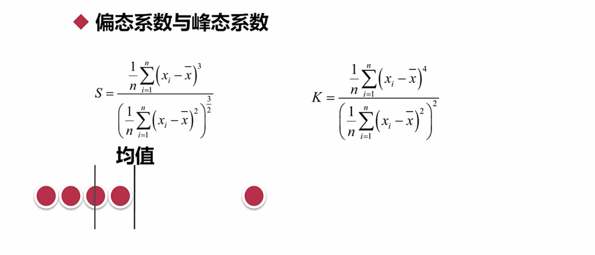

卡方分布：几个正太分布的平方和

t分布：正太分布/卡方分布

F分布：卡方分布之比

抽样误差与精度

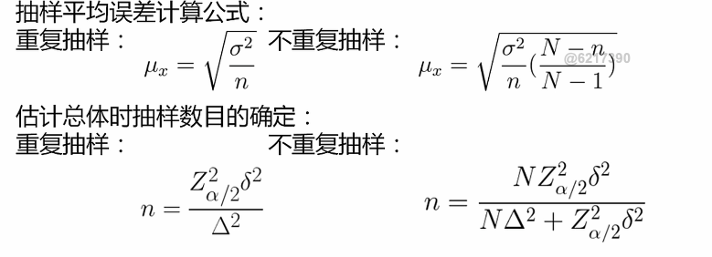

## 数据分类
- 定类（类别）根据事物离散、无差别属性进行的分类 种类
- 定序（顺序） 可以界定数据的大小，但不能测定直 年级
- 定距（间隔） 可以界定数据大小的同时，可测定直 但无绝对零点 温度
- 定比（比率） 可以界定数据大小，可测定差值，有绝对零点 身高

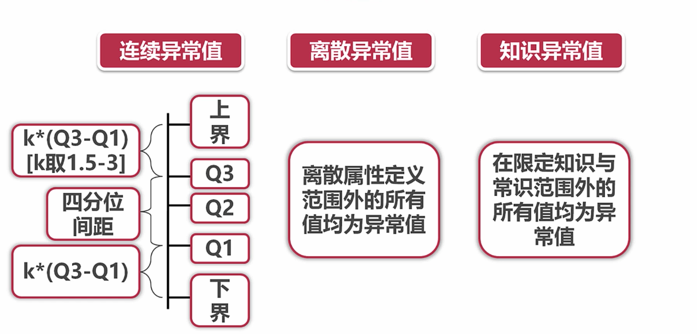
## 多因素分析
### 假设检验与方差检验 
t 检验： 判断两个是否一致

f 检验：方差分析 ANOVA

卡方检验：判断和某些是否有关

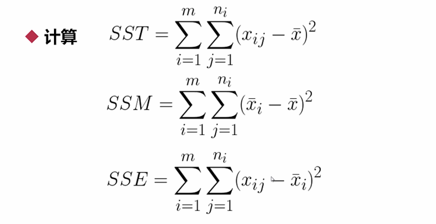

SST:总变差平方和

SSM:组间平方和

SSE:残差平方和

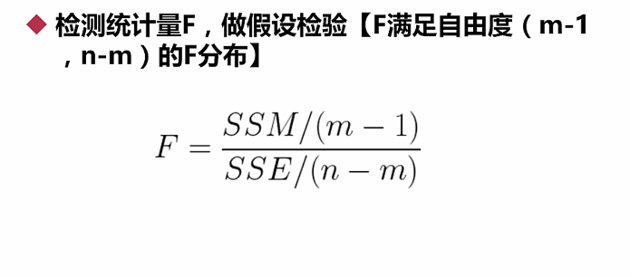

### 相关系数：皮尔逊、斯皮尔曼 

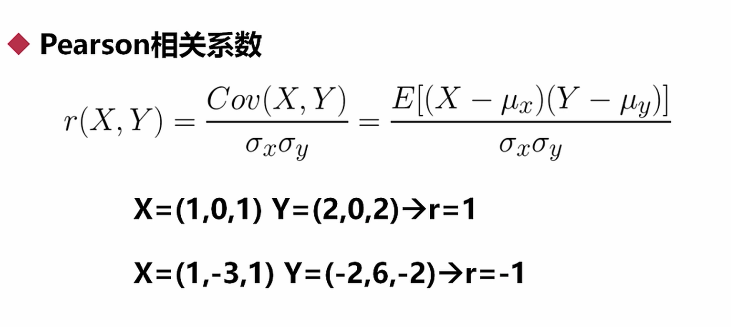

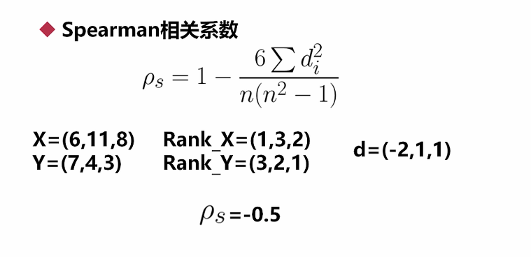

### 回归：线性回归 

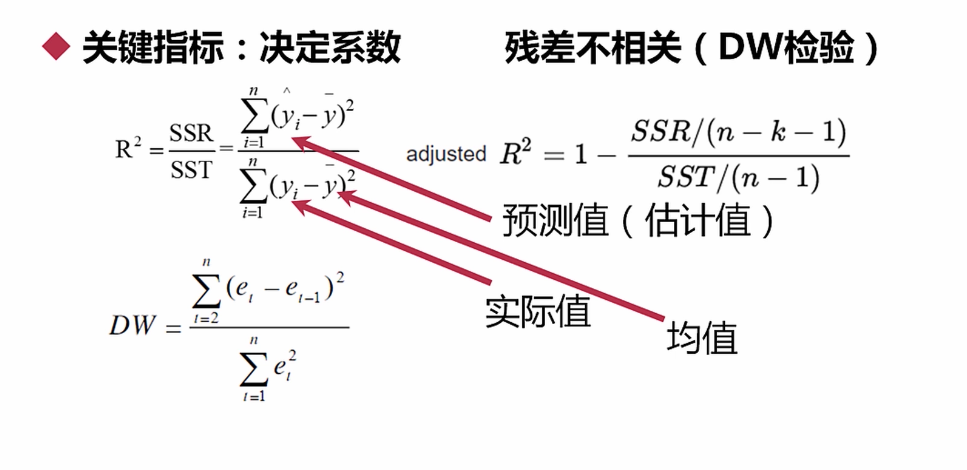

dw 为0 残差不相关

### PCA与奇异值分解
- 求特征协方差矩阵 
- 求协方差的特征值和特征向量 
- 将特征值按照从大到小的顺序排序，选择其中最大的k 
- 将样本点投影到选取的特征向量上

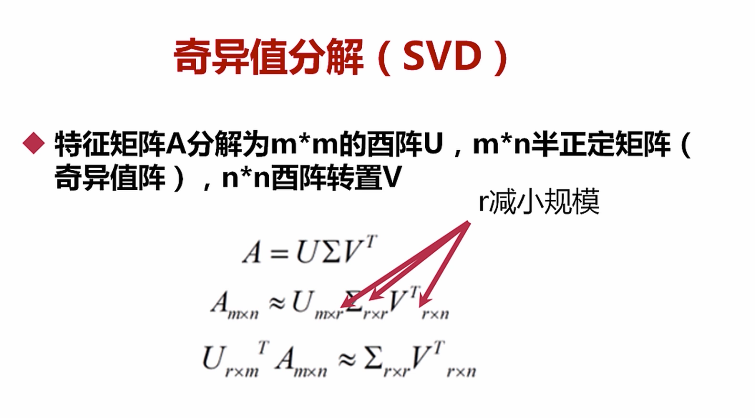

## 分组分析

### 向上钻取

每天的销售额，到每月的销售额
### 向下钻取
一本考试的成绩，男生女生的平均成绩

#### 分组方法
- 不纯度（Gini)
- 分割

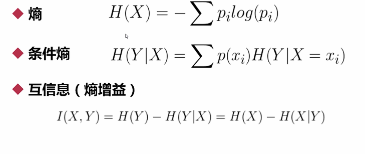

####    对于分类多的信息熵会偏大，会很大
#### 条件熵H（Y|X）表示在已知随机变量X的条件下随机变量Y的不确定性。随机变量X给定的条件下随机变量Y的条件熵H(Y|X)

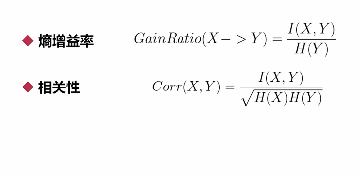

## 总结

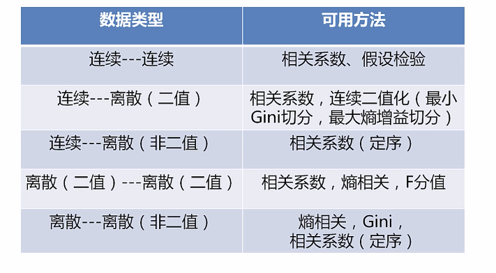

[图示分析数据](./plot.py)

[主成分分析](./eda3.py)

[交叉分析](./eda4.py)

[相关分析：熵，条件熵，gini系数](./相关分析.ipynb)

##  特征工程

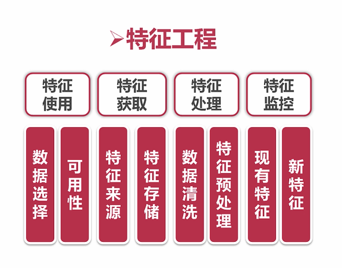

### 抽样样本采集
- 样本要具备代表性 
- 样本比例要平衡以及样本不平衡时如何处理
- 全量数据

### 异常值的处理

[异常值处理](./异常值处理.ipynb)

### 特征预处理

- 特征选择 
    - 过滤思想
    - 包裹思想 RFE 算法
    - 嵌入思想 L1，L2 正则化
- 特征变换 
- 对指化、离散化、数据平滑、归一化（标准化）、 数值化、正规化
- 特征降维 
- 特征衍生

#### 包裹思想
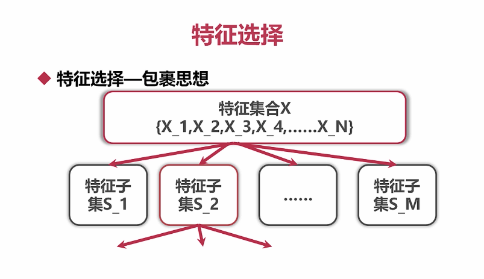

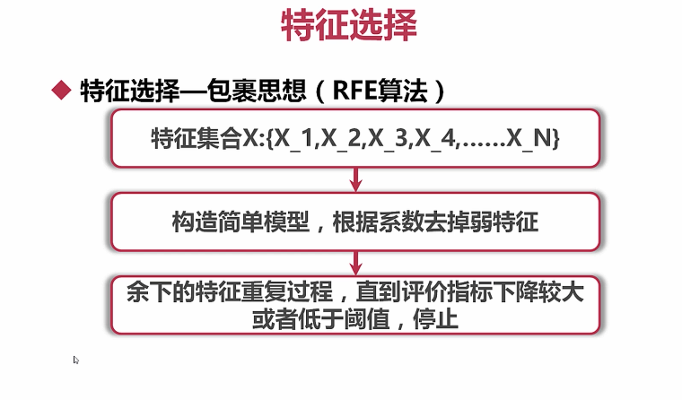

#### 嵌入思想

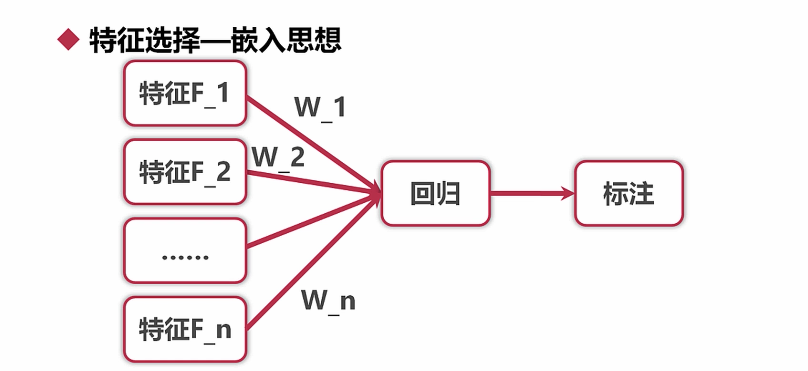

##### 注意最后选择的模型最好类似

[特征选择](./特征选择.ipynb)

### 特征变化

#### 对指化

小的数 ===》 指数化 概率

大的数 ===》 对数化 分贝

#### 离散化
- 克服数据缺陷 
- 某些算法要求 
- 非线数据映射
#### 分箱技术
等深度：

6 8 10 ｜ 15 16 24 ｜ 25 40 67

等宽：区间一直

6 8 10  15 16 24  25 ｜ 40 ｜ 67

#### 数据归一化&&标准化

min-max 归一化

#### 数值化

定类，定序数据===》数值化

定距===》归一化 消除物理含义

定序的数据 ==》 标签化

定类数据 ===》 one-hot encode 距离差距为相等

### 数据降维

核心思想．投影变换后同一标注内距离尽可能小； 不同标注间距离尽可能大。

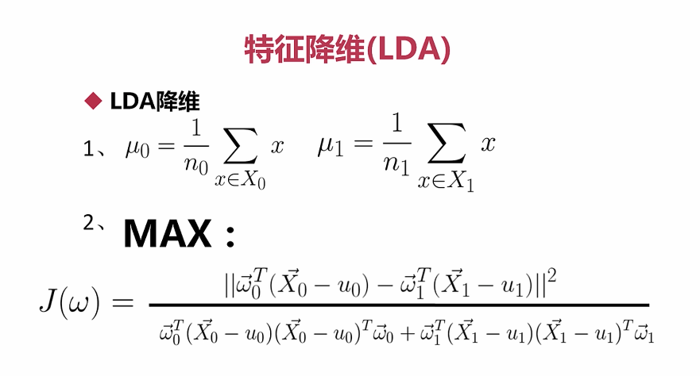

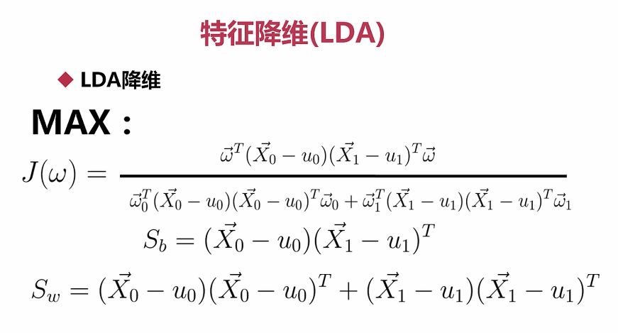