# Data-Analyse
数据分析
回顾了一下实习的使用的数据分析方法

## 基础数据操作
### Numpy

[Numpy的基础操作](./基础数据库/数组与矩阵运算.ipynb)

[Numpy的保存与加载](./基础数据库/Array的input和output.ipynb)

### Pandas
[Series](./基础数据库/Pandas/Series.ipynb)

[DataFrame](./基础数据库/Pandas/DataFrame.ipynb)

[Reindexing](./基础数据库/Pandas/Reindexing Series and DataFrame.ipynb)

[浅谈NAN](./基础数据库/Pandas/深入理解Series和Dataframe.ipynb)

[多级index](./基础数据库/Pandas/多级Index.ipynb)

[浅谈NAN](./基础数据库/Pandas/浅谈NAN.ipynb)

## 将所有业务数据经汇总处理，构成数据仓库（DW） 
- 全部事实的记录 
- 部分维度与数据的整理（数据集市一DM）

## 数据库VS仓库 
- 数据库面向业务存储/仓库面向主题存储（主题较高层次上对分忻对象数据的一个完整并且一致的描述）
- 数据库针对应用（OLTP），仓库针对分析（OLAP）
- 数据库组织规范，仓库可能冗余，相对变化大，数据量大

- 数据获取手段·监测与抓取 戔解析网页、接口、文件的信息

## 探索分析数据分析

### 单因子数据可视化

#### 集中趋势

均值、中位数、众数、分位数

均值: 连续值

中位数： 有离散效果

标准差,方差：

-1.96 ~1.96 90%

偏态系数与峰态系数：判断是不是正态分布:中位数和平均事的比较，表述数据集中的状态,越大数据分布约尖，正态分布的峰度系数为3

卡方分布：几个正太分布的平方和

t分布：正太分布/卡方分布

F分布：卡方分布之比

抽样误差与精度

## 数据分类
- 定类（类别）根据事物离散、无差别属性进行的分类 种类
- 定序（顺序） 可以界定数据的大小，但不能测定直 年级
- 定距（间隔） 可以界定数据大小的同时，可测定直 但无绝对零点 温度
- 定比（比率） 可以界定数据大小，可测定差值，有绝对零点 身高

## 多因素分析
### 假设检验与方差检验 
t 检验： 判断两个是否一致

f 检验：方差分析 ANOVA

卡方检验：判断和某些是否有关

SST:总变差平方和

SSM:组间平方和

SSE:残差平方和

### 相关系数：皮尔逊、斯皮尔曼 

### 回归：线性回归 

dw 为0 残差不相关

### PCA与奇异值分解
- 求特征协方差矩阵 
- 求协方差的特征值和特征向量 
- 将特征值按照从大到小的顺序排序，选择其中最大的k 
- 将样本点投影到选取的特征向量上

## 分组分析

### 向上钻取

每天的销售额，到每月的销售额
### 向下钻取
一本考试的成绩，男生女生的平均成绩

#### 分组方法
- 不纯度（Gini)
- 分割

####    对于分类多的信息熵会偏大，会很大
#### 条件熵H（Y|X）表示在已知随机变量X的条件下随机变量Y的不确定性。随机变量X给定的条件下随机变量Y的条件熵H(Y|X)

## 总结

[图示分析数据](./plot.py)

[主成分分析](./eda3.py)

[交叉分析](./eda4.py)

[相关分析：熵，条件熵，gini系数](./相关分析.ipynb)

##  特征工程

### 抽样样本采集
- 样本要具备代表性 
- 样本比例要平衡以及样本不平衡时如何处理
- 全量数据

### 异常值的处理

[异常值处理](./异常值处理.ipynb)

### 特征预处理

- 特征选择 
    - 过滤思想
    - 包裹思想 RFE 算法
    - 嵌入思想 L1，L2 正则化
- 特征变换 
- 对指化、离散化、数据平滑、归一化（标准化）、 数值化、正规化
- 特征降维 
- 特征衍生

#### 包裹思想

#### 嵌入思想

##### 注意最后选择的模型最好类似

[特征选择](./特征选择.ipynb)

### 特征变化

#### 对指化

小的数 ===》 指数化 概率

大的数 ===》 对数化 分贝

#### 离散化
- 克服数据缺陷 
- 某些算法要求 
- 非线数据映射
#### 分箱技术
等深度：

6 8 10 ｜ 15 16 24 ｜ 25 40 67

等宽：区间一直

6 8 10  15 16 24  25 ｜ 40 ｜ 67

#### 数据归一化&&标准化

min-max 归一化

#### 数值化

定类，定序数据===》数值化

定距===》归一化 消除物理含义

定序的数据 ==》 标签化

定类数据 ===》 one-hot encode 距离差距为相等

### 数据降维

核心思想．投影变换后同一标注内距离尽可能小； 不同标注间距离尽可能大。

[特征变换](./特征变换.ipynb)

## 机器学习算法
- KNN
- 朴素贝叶斯
- 决策树

### 生成模型
- 生成模型：通过求输入与输出的联合概率分布，再求解类别归类的概率 速度快
    - naive-bayes
    - 混合高斯模型
- 判别模型：不通过联合概率分布，直接可以获得输出对应最大分类的概率 对数据更好
    - KNN
    - 决策树
    - 罗辑回归
    - 支持向量机
    - SVM
    - boosting方法

### KD-tree

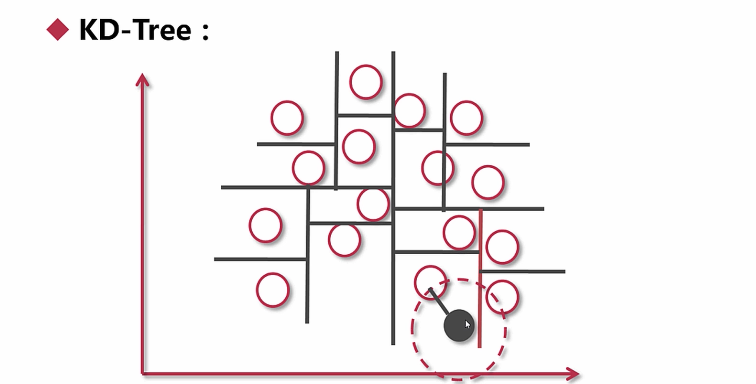

- 朴素贝叶斯

### 拉普拉斯平滑

就是对于每个条件概率+1

## 决策树

- ID3 - 信息增益
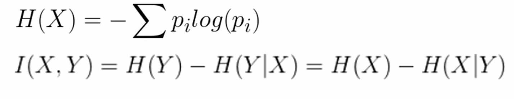
- C4.5 信息增益率

### 考虑到熵增益会很小/除以本身切分的熵
- Cart gini系数

### 决策问题

连续值切分-计算每个分隔 

规则用尽-投票

过拟合-修枝剪叶

- 前剪枝：深度，叶子个数
- 后剪枝：后显示

## SVM
- 几个问题

- 不一定线性可分
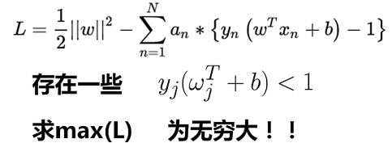

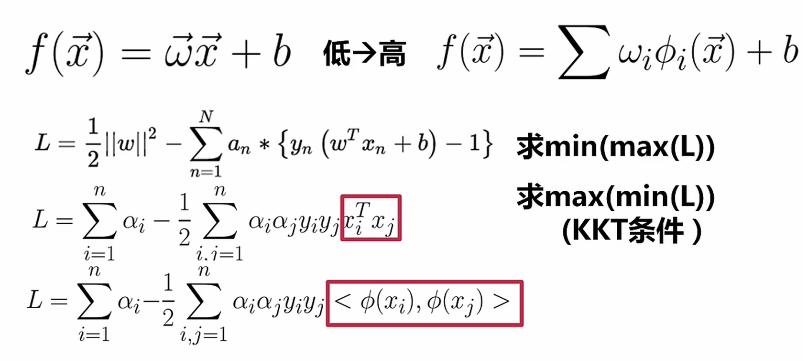

先映射，再计算 维度灾难
先计算（低维空间） 核函数

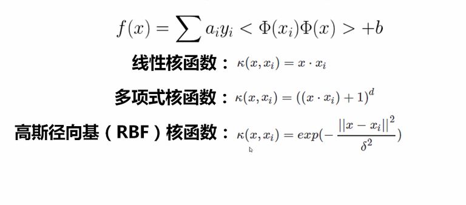

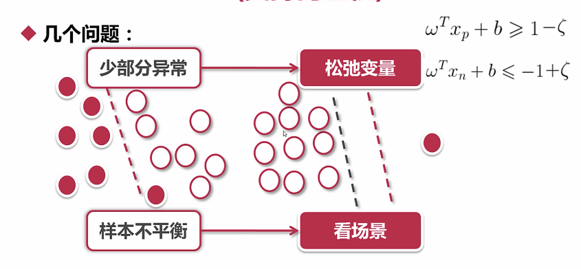

- 多分类

    - one-other
    - one-one 
    
## 集成方法
- bagging
    - 随机森林
        - 树的个数 
        - 树的特征数
        - 树的训练测试集 放回采样
- boosting
    - Adaboost 
    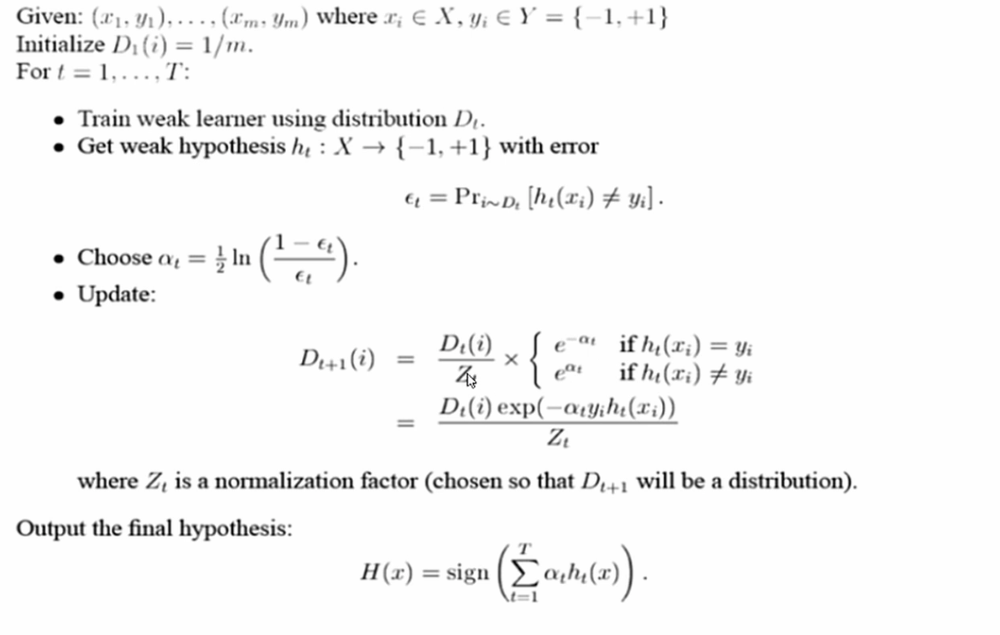
    精度高，目自动舌可调 几乎不用担心过拟合 简化特征工程流程

## 回归 
- 线性回归
  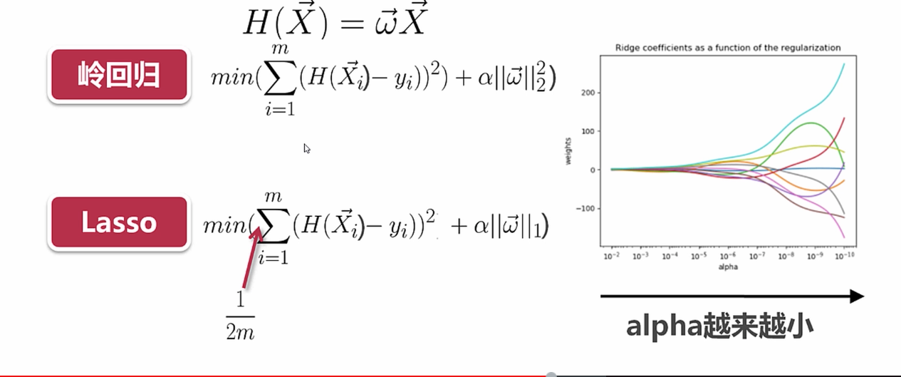
  
- 逻辑回归
   
- 人工神经网络
    - 易受离群点影响，易过拟合（正则化，dropout） 
    - 属性与结果要在0、1之间 
    - 输出结果进行Softma×转化
 
- 提升树 && GBDT

[HR数据](./HR数据处理.ipynb)

      
## 非监督学习 

- 聚类
    - kmeans
    - 层次算法
    - DBSCAN:Density-Based SpatiaI Clustering Of AppIications with Noise
    - Split
- 关联规则

## kmeans 
- 1、初始质心位置可能会影响最终聚类结果。 
   
   解决思路：多试几次，取最稳定结果。
   
- 2、个别离群值会影响整体聚类效果。

    解决思路：换取中点，k-Medoids方法。
    
## DBSCAN

- E邻域:给定对象半径为E内的区域称为该对象的E邻域 
- 核心对象:如果给定对象E领域内的样本点数大于等于MinPts ，则称该对象为核心对象 
- 直接密度可达: 对于样本集合D，如果样本点q在p的E领域内， 并目p为核心对象，那么对象q从对象p直接密度可达
- 密度可达对于样本集合D，给定一串样本点pl，p2一pn p=pl,q=pn，假如对象pi从pi·1直接密度可达，那么对象q从对象p密度可达 
- 密度相连: 存在样本集合D中的一点0，如果对象0到对象p和 对象q都是密度可达的，那么p和q密度相连
- 为了找到密度相连对象的最大集合

### 几个问题

- 离群点较不敏感 
- 需要KD一Tree等数据结构辅助

## 层次聚类

- 最短距离 
- 最长距离 
- 平均距离 
- ward 其实就是方差增加越小，越要放到一个组

### 优缺点
- 聚类灵活 
- 计算复杂度比较高，离群点影响比较大

## 图分裂算法

  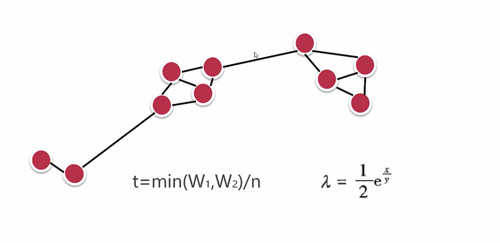
  
  W1,W2 为两边的图联通的节点数
  
  n 为切断两个的联通分量
  
  x 最大联通图边的数量
  
  y 最大联通图的点数量
  
  t 为承重系数 > lambda 为阈值 应该切分
  

 与基本层次聚类思路相反，为从顶至下 图建立方式、分裂方式可以非常灵活

[非监督学习](./非监督学习.ipynb)

## 关联规则

- 项目：一个字段，对交易来说一般是指一次交易中的一个物 品，如：尿布 
- 事务：某个客户在一次交易中，发生的所有项目的集合 如 {尿布，啤酒} 
- 项集：包含若干个项目的集合（一次事务中的） 
- 频繁项集：某个项集的支持度大于设定阈值（人为设定或者 根据数据分布和经验来设定），即称这个项集为频繁项集，
- 支持度：项集{×，Y}在总项集中出现的概率（Support） 
- 置信度：在先决条件×发年的条件下，由关联规则{X->Y} 推出Y的概率（Confidence）
- 提升度：表示含有×的条件下同时含有Y的概率，与无论含不含 ×含有Y的概率之比（Confidence({X}+{Y})/Support({Y})）

> 1 提升度

  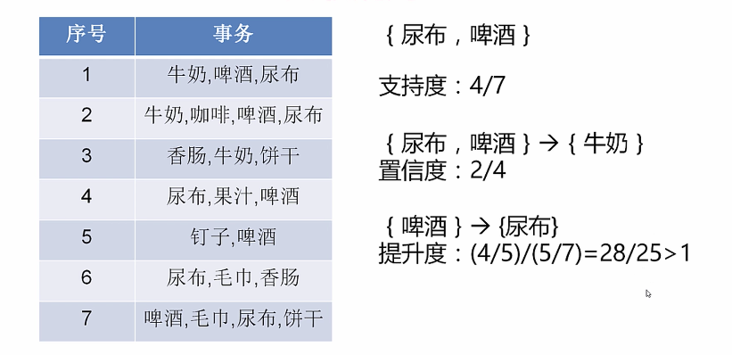
  
### Apriori 

SupportThreshoId：s_th

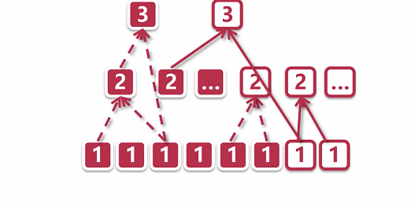

## Apriori ALL

序列规则将时间因素考虑进来，剔除关联规则中时间点靠 后的顶对时间点靠前的顶的支持

Forward：Apriori 

Backward：卓时间序列之后的项对之前的项的支持

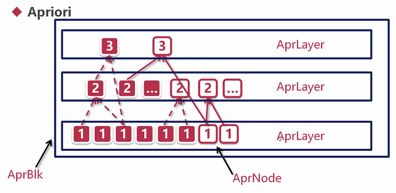

[Apriori 算法](./Apriori%20算法.ipynb)

## 半监督学习

- 样本集部分有标注，部分无标注（常远大于有标注样本 获取标注的成本较大)

### 标签传播算法 Label propagation
- KNN
- RBF

[半监督学习](./半监督学习.ipynb)

# 模型评估

## 分类
### 二分类

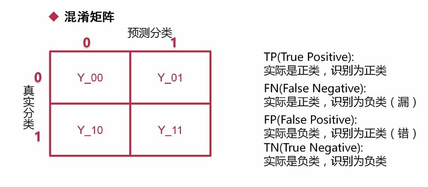

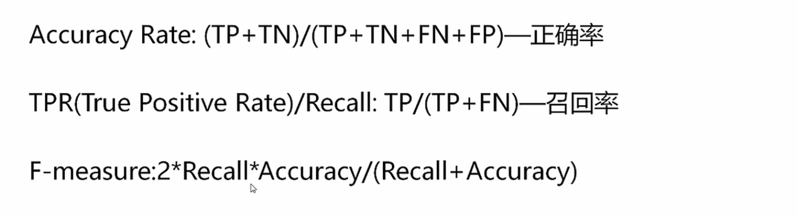

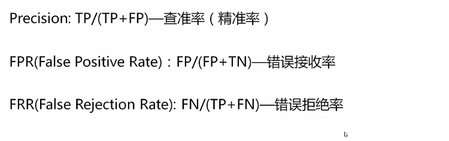

### 多元

- 1、先计算所有的TP，FN等，再以二值方法去计算  sklearn micro
- 2、分别把每个类别当作正类都算一个召回或者F值，然后取加权或者不加仅的平均 marco

### ROC 曲线 

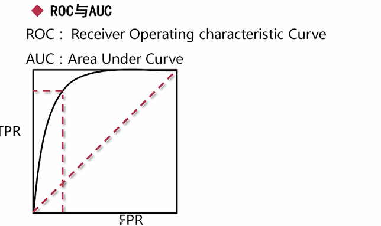

ROC曲线能很容易地查出任意界限值 时的对茌能的识别能力

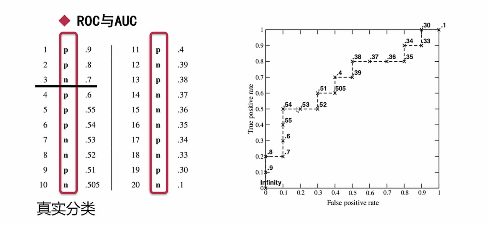

### 增益图 与 KS 图

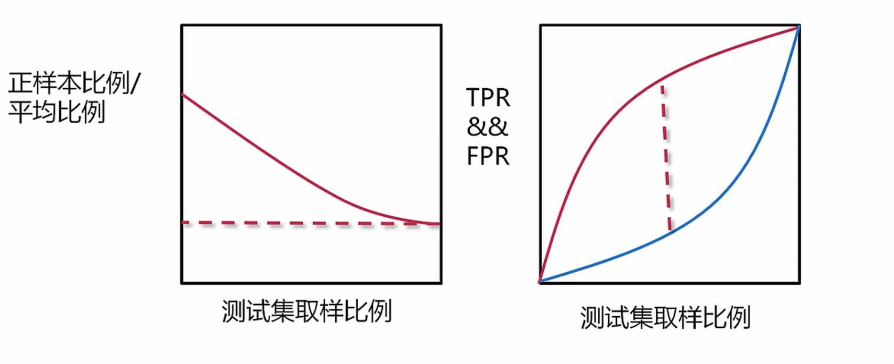

## 回归

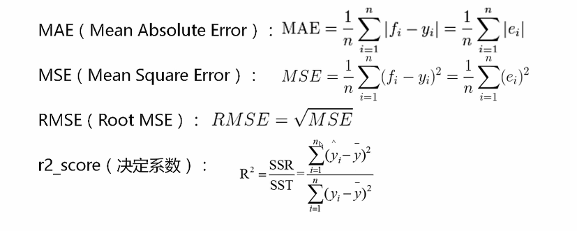

## 非监督评估 -聚类

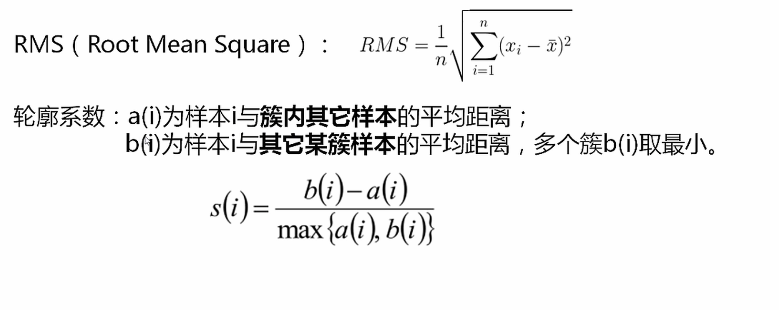

a(i): 类聚度

b(i): 分离度

## 非监督评估 - 关联

- 支持度
- 置信度
- 提升度

轮廓系数为1好，-1不好

# 总结

思想其实完全一样，只不过工具不一样

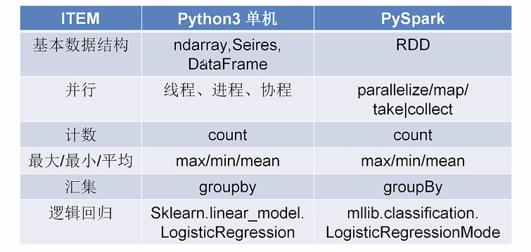

